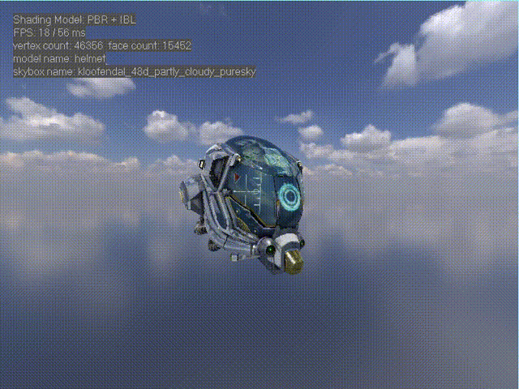
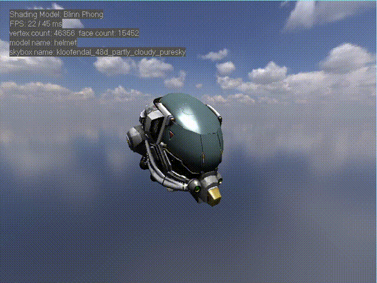

# MoRenderer

MoRenderer is a software rasterization renderer based on c++11. The main purpose of the project is to learn the principles of modern rendering. Currently only Windows is supported (uses win32 to display window and image)




## Feature

-   simple math library
    -   vector library
    -   matrix library
    -   utility functions
-   Programmable shader（writing in c++）
    -   vertex shader
    -   pixel shader
-   culling & clipping
    -   back-face culling: use the normal of the triangle plane
    -   homogeneous clipping: clip is performed only for the near clipping plane
-   z-buffer
    -   depth testing
    -   reverse z-buffer 
-   Edge Equation
    -   traversal triangle using a bounding rectangle
    -   the Edge Equation is used to perform the inside test of the triangle
    -   Perspective correct interpolation
    -   use Top-Left rule to handle boundary pixels
-   texture sampling
    -   use bilinear interpolation to get better texture effect
    -   cubemap sampling
-   orbital camera controls
    - Orbit
    - Pan
    - Zoom
    - Reset
-   tangent space normal mapping
-   ACES tone mapping
-   shading model
    -   Blinn-Phong shading
    -   Physically Based Shading (use Cook-torrance BRDF)
-   material inspector
    -   use keyboard number to switch material inspector
    -   Blinn-Phong material inspector
    -   Physically Based Shading material inspector
    -   wireframe rendering
-   image-based lighting (IBL)
    -   irradiance map
    -   prefilter specular environment map
    -   use cmgen to automatic generate the IBL resource
-   skybox 
    -   place a plane on the far clipping plane
    -   switch the skybox at runtime
-   other control
    -   switch the shading model at runtime
    -   switch the model at runtime


## Previews

### Camera Control


### PBR Material Inspector


### Blinn-Phong Material Inspector


### Switch Rendering Mode


### Switch Assets


### Wireframe && Clip && Skybox


## Build

A CMakeLists.txt file is provided for generating project files using CMake

### Visual Studio

```
mkdir build
cd build
cmake -G "Visual Studio 17 2022" ..
start Renderer.sln
```

## Control
### Camera Control
-   Orbit: left mouse button
-   Pan: right mouse button
-   Zoom: mouse wheel \ Q E
-   move model: W A S D
-   Reset Camera: Space

### Material Inspector Control
-   Blinn-Phong shading: keyboard number 1-7
-   Physically Based Shading: keyboard number 1-8
-   Wireframe rendering：keyboard number 0

### Assets Control
-   Switch model: keyboard up/down
-   Switch skybox: keyboard left/right


## Reference

[filament](https://github.com/google/filament "filament")

[stb_image.h](https://github.com/nothings/stb "stb_image")

[tiny_obj_loader.h](https://github.com/tinyobjloader/tinyobjloader "tiny_obj_loader")

skywind3000's implementation of [software renderer](https://github.com/skywind3000/RenderHelp "software renderer")

SunXLei's implementation of [software renderer](https://github.com/SunXLei/SRender "software renderer")

[《Real-Time Rendering 4th》CN](https://github.com/Morakito/Real-Time-Rendering-4th-CN "《Real-Time Rendering 4th》CN")
