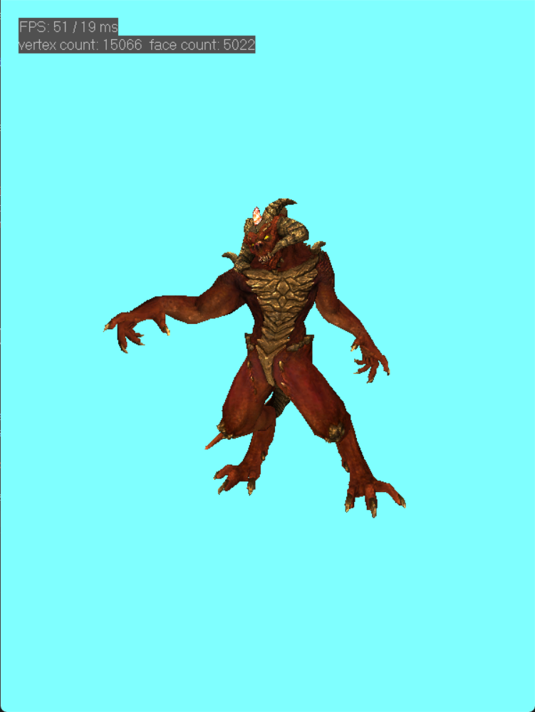

# MoRenderer（Unfinished）

MoRenderer is a software rasterization renderer based on c++11. The main purpose of the project is to learn the principles of rendering. Currently only Windows is supported (uses win32 to display window and image)



## Feature

-   simple math library
    -   vector library
    -   matrix library
    -   utility functions
-   Programmable shader（writing in c++）
    -   vertex shader
    -   pixel shader
-   culling & clipping
    -   back-face culling: use the normal of the triangle plane
    -   homogeneous clipping: clip is performed only for the near clipping plane
-   z-buffer
    -   depth testing
    -   reverse z-buffer 
-   Edge Equation
    -   traversal triangle using a bounding rectangle
    -   the Edge Equation is used to perform the inside test of the triangle
    -   Perspective correct interpolation
    -   use Top-Left rule to handle boundary pixels
-   texture sampling
    -   use bilinear interpolation to get better texture effect
-   orbital camera controls
    - Orbit
    - Pan
    - Zoom
    - Reset
-   tangent space normal mapping
-   shading model
    -   Blinn-Phong shading


## ToDo List

-   image-based lighting (IBL)
-   PBR shading
-   tone mapping
-   material inspector

## Build

A CMakeLists.txt file is provided for generating project files using CMake

### Visual Studio

```
mkdir build
cd build
cmake -G "Visual Studio 17 2022" ..
start Renderer.sln
```

## Camera Control
-   Orbit: left mouse button
-   Pan: right mouse button
-   Zoom: mouse wheel \ Q E
-   move model: W A S D
-   Reset: Space
## Reference

[stb_image.h](https://github.com/nothings/stb "stb_image")

[tiny_obj_loader.h](https://github.com/tinyobjloader/tinyobjloader "tiny_obj_loader")

skywind3000's implementation of [software renderer](https://github.com/skywind3000/RenderHelp "software renderer")

SunXLei's implementation of [software renderer](https://github.com/SunXLei/SRender "software renderer")

[《Real-Time Rendering 4th》CN](https://github.com/Morakito/Real-Time-Rendering-4th-CN "《Real-Time Rendering 4th》CN")
